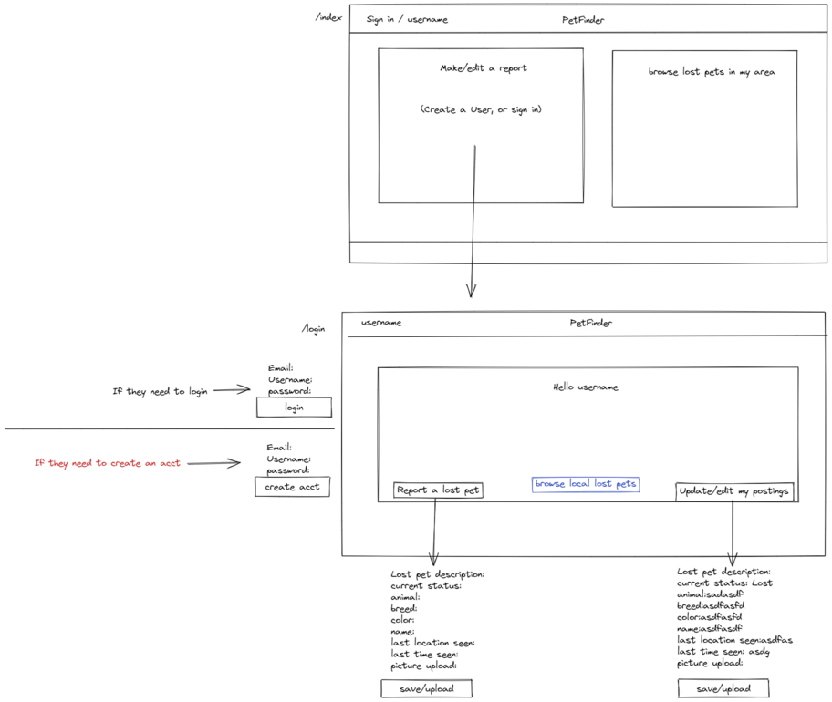

# Lost Pet Project
## Overview

Once the USER is at the landing page of `/home` they can choose to login/sign-up or browse lost pets. If they want to login or sign-up they need to click the button on the left, which is a picture of a puppy. If they want to browse lost pets they need to click on the button on the right, which is a picture of a kitten.
The `/login` page will take the USER's input of USERNAME, EMAIL and PASSWORD (minimum of 8 characters)and either register them for a new account or they can use their existing credentials to login.
Once logged in, they will be redirected to the `/dashboard` which has a form to fill out about your lost pet. Once you fill out the form you can upload an image to the database of lost pets. Then, to view lost pets and to see your newly created missing pet you can click the Browse button.
Once you click the Browse button you will be redirected to the `/browse` page. On the browse page you will see a map of you lost pet's last location as well as any other lost pet's last locations.

## License(s)
[](https://opensource.org/licenses/MIT)


## table of contents
1. [Description](#description)
2. [Installation](#installation)
3. [Usage](#usage)
4. [Credits](#credits)
5. [License](#license)
6. [Questions](#questions)
        
        
        
## Description

According to the American Human blog, approximately 10 million pets are lost in the United States each year. Tragically, only 15 percent of dogs and 2 percent of cats are reunited with their owners. We build this application to increase those numbers. People can come to our website to add their pets when they lost them or when they are found the pet. With a picture, pet name, description, and last location (latitude, longitude) people can easily find their pet and see other pets found or lost on the map.

Lost Pet Finder allows a USER to create an account and generate a listing of their current lost pet and display it in a page for local discovery. It allows other USERS to view current lost pets without an account.

The Motivation for building this project is a another resource for USERS to locally find their pets and view other lost pets, in collaboration to locate their pet. Gives the USER the option to fully describe their animal and last location spotted

This project solves the issue of not enough resources to locally find their pet when they go missing. It allows collaboration with other USERS and non USERS to locate their pet.

The knowledge gained from this project is collectivily utilization of NODE and EXPRESS while backed by MYSQL. To build routes using get and post requirements. Deploying on Heroku and using a new library or package. Building authentication for the site.

        
        
## Installation
Instuctions are as follows:

- [bcrypt](https://www.npmjs.com/package/bcrypt)

- [cloudinary](https://www.npmjs.com/package/cloudinary)
- [connect-seesions-sequelize](https://www.npmjs.com/package/connect-session-sequelize)
- [dotenv](https://www.npmjs.com/package/dotenv)
- [express](https://www.npmjs.com/package/express)
- [express-handlebars](https://www.npmjs.com/package/express-handlebars)
- [express-session](https://www.npmjs.com/package/express-session)
- [mysql2](https://www.npmjs.com/package/mysql2)
- [sequelize](https://www.npmjs.com/package/sequelize)

Once all the necessary NPM packages are installed you will need to add the following custom scripts to your package-json:
 - ` "resetdb": "mysql -u root -p <  ./db/schema.sql",`
 - ` "seed": "node seeds/index.js",`
 - ` "start": "node server.js" `
 Then you will need to open your integrated terminal and execute each script. This will create your table, seed it with some data and start your server


        
        
## Usage

Wireframe



Live Demo


        
## Credits
Pablo Rosales
```sh
https://github.com/Pablito14
```
Bakary Sylla
```sh
https://github.com/Abou2022
```
Jeff Schmidt
```sh
https://github.com/Jeff-T-Schmidt
```
Hayden Kiltoff
```sh
https://github.com/hayden1773
```

        
## Features


        
        
## Tests 
